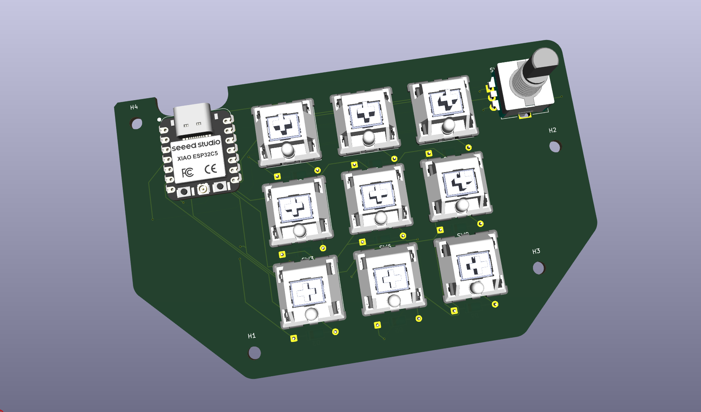
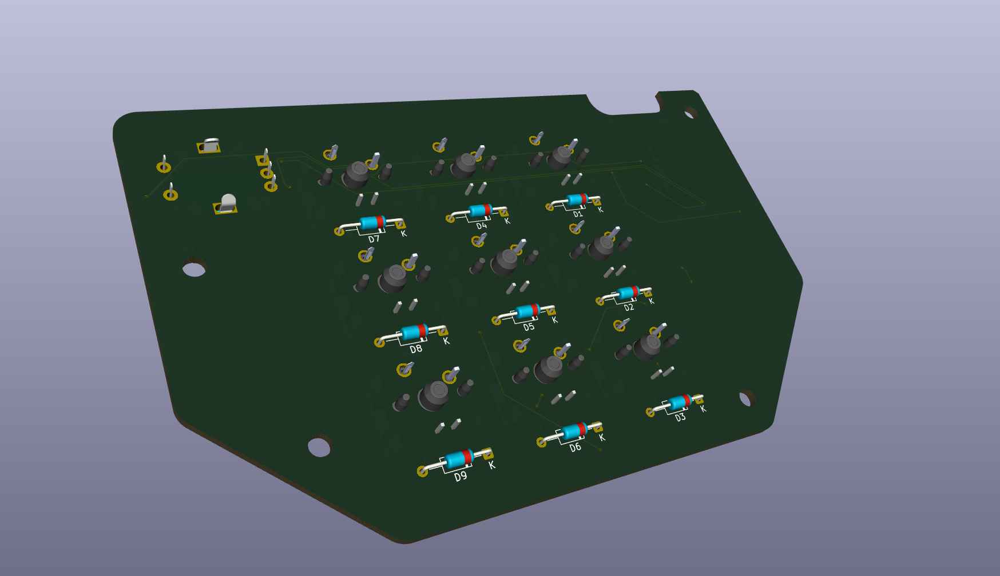
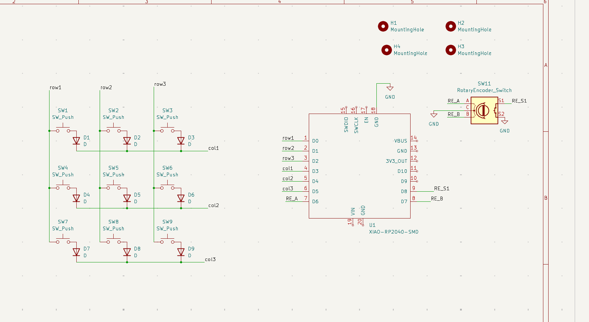
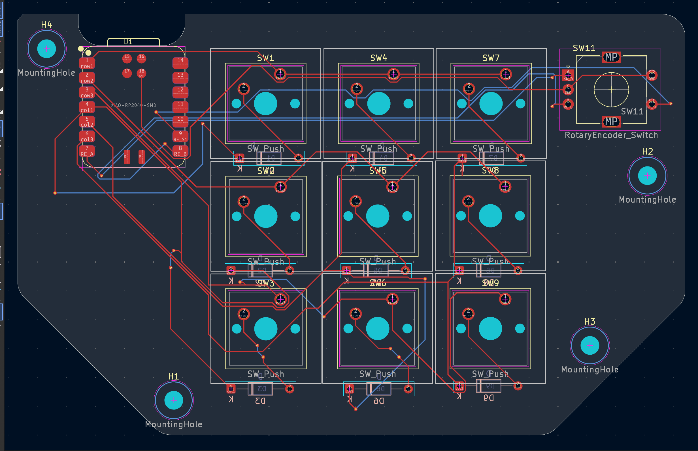

# My Hackpad

hey! this is my hackpad :)

i created this project to practice pcb design, electronics and firmware and at the same time create something i will be able to use on my desk.

the concept of this project is quite easy – small macropad with custom keys, rotary encoder and custom pcb. you can use it to set up your shortcuts, macros, control devices, etc.

## What is it

my hackpad has:

- 9 mechanical switches
- 1 rotary encoder
- XIAO RP2040
- 9 diodes
- 4 mounting holes
- custom PCB
- 3D printed case

i have built almost everything on my own so i would be able to understand the entire process of creating such device.

## Pictures / Files

### 3D Model

### Circuit / Schematic

### PCB Circuit

## BOM

here is the list of parts needed for the hackpad:

## Bill of Materials (BOM)

Here are the parts used for this build:

| Item                                       | Quantity |      Price | Link                                                                                                                                                                                                                                                                                                                             |
| ------------------------------------------ | -------: | ---------: | -------------------------------------------------------------------------------------------------------------------------------------------------------------------------------------------------------------------------------------------------------------------------------------------------------------------------------- |
| Seeed Studio XIAO RP2040 Development Board |        1 |       ₹589 | [Robu / RoboCraze](https://robocraze.com/products/seeed-studio-xiao-rp2040-development-board?variant=47742255562976&country=IN&currency=INR)                                                                                                                                                                                     |
| Rotary Encoder (PEC12R-4225F-S0024)        |        1 |       ₹159 | [LionCircuits](https://www.lioncircuits.com/parts/PEC12R-4225F-S0024)                                                                                                                                                                                                                                                            |
| Cherry MX Mechanical Switches (Pack of 10) |        9 |       ₹350 | [Cosmic Byte](https://www.thecosmicbyte.com/product/cherry-mx-mechancial-5-pin-switches-compatible-with-hot-swappable-keyboards-pack-of-10/?attribute_pa_switch-type=mx-silent-red)                                                                                                                                              |
| Spongebob Artisan Keycaps                  |        9 |       ₹0 (already have) | [Meckeys](https://meckeys.com/shop/accessories/keyboard-accessories/keycaps/artisan-keycaps/spongebob-artisan-keycaps/)                                                                                                                                                                                                          |
| PCB Fabrication                            |        1 |       ₹720 | [JLCPCB](https://jlcpcb.com)                                                                                                                                                                                                                                                                                                     |
| Diodes                                     |        9 |       ₹149 | [Diode](https://rees52.com/products/100pcs-diode-assortment-kit-rectifier-diode-kit-8-values-diy-electronic-diode?variant=43607283597479&country=IN&currency=INR&utm_medium=product_sync&utm_source=google&utm_content=sag_organic&utm_campaign=sag_organic&srsltid=AfmBOopfW6l_PCFEGSpIn1MzWFSyL2kUMnO_pwWWxPw7mdDOjD9aFjIchQY) |
| 3D Printed Case                            |        1 |          — | —                                                                                                                                                                                                                                                                                                                                |
| **Total Cost**                             |          | **₹1,967** |                                                                                                                                                                                                                                                                                                                                  |

## Assembly Steps

1. Put the PCB on the bottom plate and fix it by using **M3 Screws**.
2. Fasten the upper portion of the box to the bottom plate with the help of **Glue**.
3. The use of M3 screws is **optional**. You can also fasten the whole box with the help of glue.
4. Ensure that everything is properly aligned.

## Why did i build this?

because i wanted to learn to create a circuit board myself rather than always purchasing them off the shelf. a custom macropad seemed to be an engaging way of learning and having something useful that i could use at my desk.

also built for Hack Club because it allowed me to engage in the process of building the circuit board from scratch without letting it stay only in my head.
